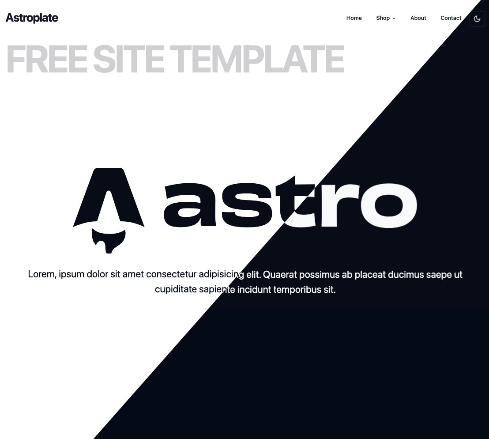

# Astroplate

An Astro template that uses shadcn/ui.



## 🚀 Project Structure

Inside of your Astro project, you'll see the following folders and files:

```text
/
├── README.md
├── astro.config.mjs
├── bun.lockb
├── components.json
├── package.json
├── public
│   └── favicon.svg
├── src
│   ├── components
│   │   ├── CartDrawer.tsx
│   │   ├── ContactCard.tsx
│   │   ├── Header
│   │   │   ├── Header.astro
│   │   │   ├── MenuBar.tsx
│   │   │   ├── MobileMenuBar.tsx
│   │   │   ├── ModeToggle.tsx
│   │   │   └── NavDropdownItem.tsx
│   │   └── ui
│   │       ├── accordion.tsx
│   │       ├── button.tsx
│   │       ├── card.tsx
│   │       ├── drawer.tsx
│   │       ├── dropdown-menu.tsx
│   │       ├── input.tsx
│   │       ├── label.tsx
│   │       ├── navigation-menu.tsx
│   │       ├── scroll-area.tsx
│   │       ├── select.tsx
│   │       ├── sheet.tsx
│   │       └── textarea.tsx
│   ├── env.d.ts
│   ├── layouts
│   │   ├── PageHeader.astro
│   │   └── Root.astro
│   ├── lib
│   │   ├── constants.ts
│   │   └── utils.ts
│   ├── pages
│   │   ├── about.astro
│   │   ├── contact.astro
│   │   ├── index.astro
│   │   ├── shop
│   │   │   └── [country].astro
│   │   └── shop.astro
│   └── styles
│       └── globals.css
├── tailwind.config.mjs
└── tsconfig.json
```

Astro looks for `.astro` or `.md` files in the `src/pages/` directory. Each page is exposed as a route based on its file name.

There's nothing special about `src/components/`, but that's where we like to put any Astro/React/Vue/Svelte/Preact components.

Any static assets, like images, can be placed in the `public/` directory.

## 🧞 Commands

All commands are run from the root of the project, from a terminal:

| Command                       | Action                                           |
| :---------------------------- | :----------------------------------------------- |
| `bun install`                 | Installs dependencies                            |
| `bunx --bun astro dev`        | Starts local dev server at `localhost:4321`      |
| `bunx --bun astro build`      | Build your production site to `./dist/`          |
| `bunx --bun astro preview`    | Preview your build locally, before deploying     |
| `bunx --bun astro`            | Run CLI commands like `astro add`, `astro check` |
| `bunx --bun astro -- --help`  | Get help using the Astro CLI                     |

## 👀 Want to learn more?

Feel free to check [the Astro documentation](https://docs.astro.build) or jump into the [Astro Discord server](https://astro.build/chat).
